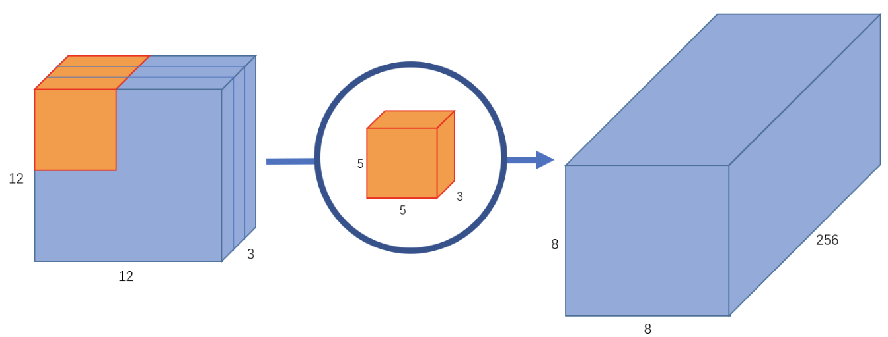
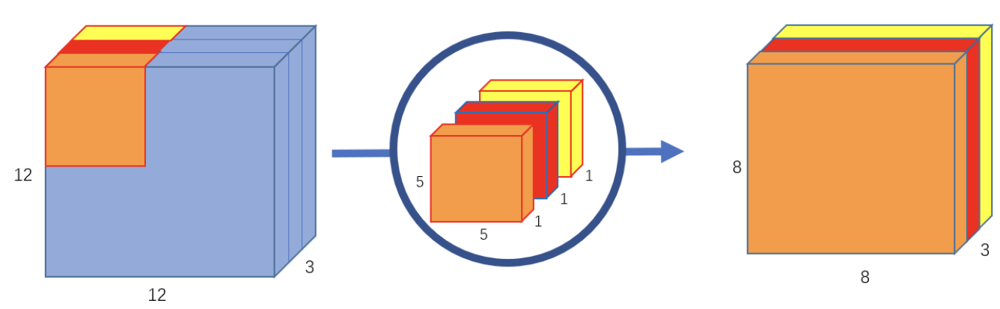
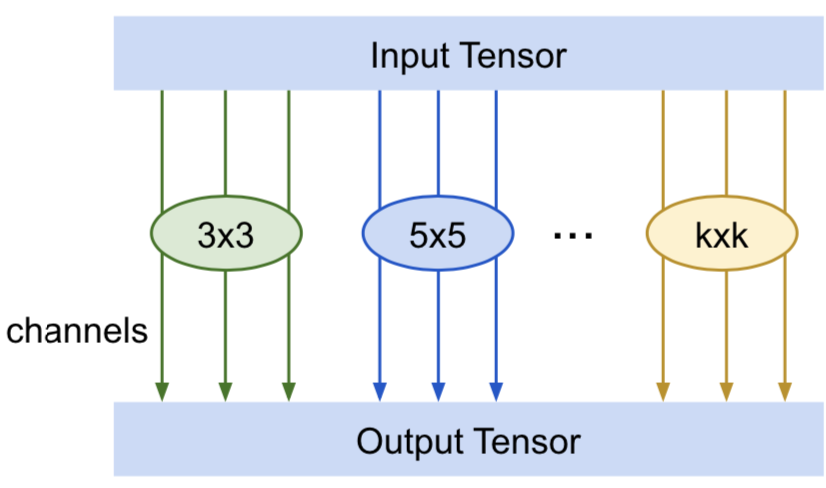
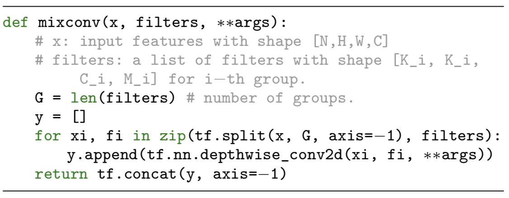
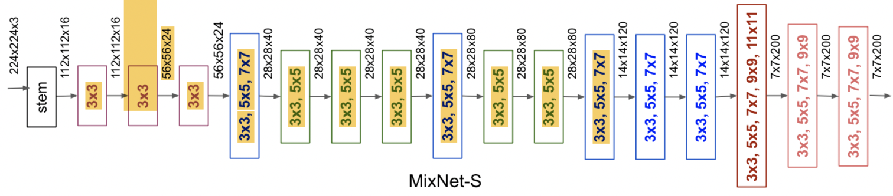
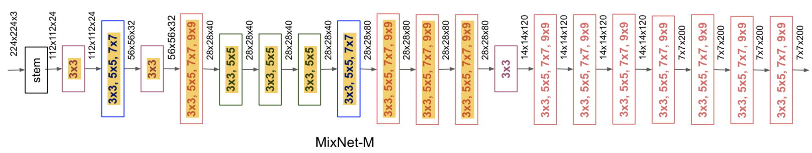
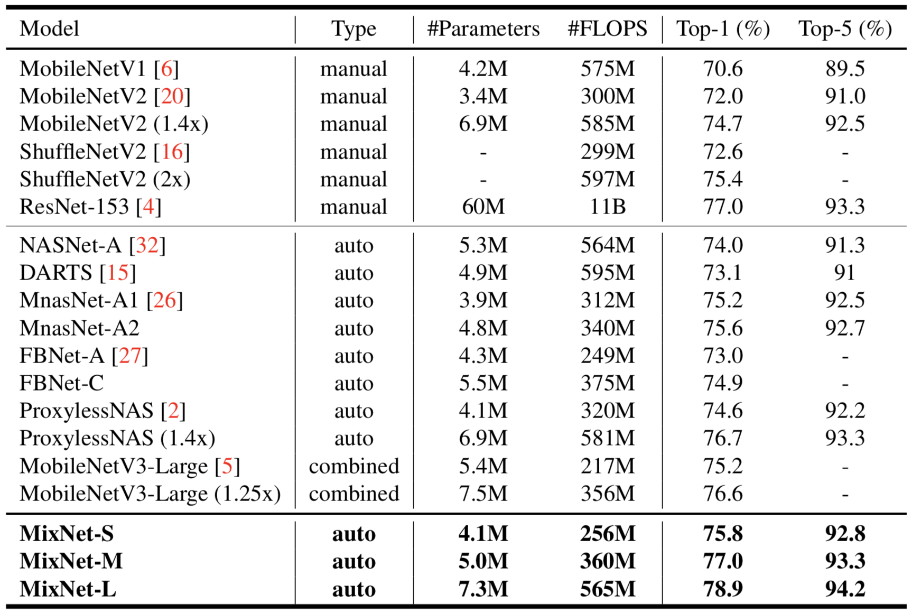
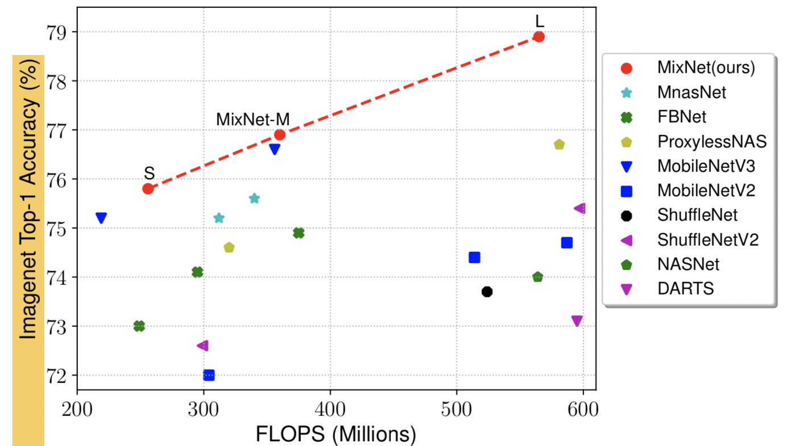

# MIXCONV: MIXED DEPTHWISE CONVOLUTIONAL KERNELS

## Introduction:
Depthwise convolution is becoming increasingly popular in modern efficient ConvNets, such as MobileNet, but its **kernel size** is often overlooked. 

Although conventional practice is to simply use 3x3 kernels, some research results have shown **larger kernel sizes** such as 5x5 kernels  and 7x7 kernels can **potentially improve model accuracy and efficiency**.

Large kernels tend to capture high-resolution patterns with more details at the cost of more parameters and computations. However, **very large kernel sizes** can potentially **hurt both accuracy and efficiency**.

As a result, it's difficult to descide the suitable kernel size.

**Mixed depthwise convolution (MixConv)** mixes up **different kernel sizes in a single convolution operation**, such that it can easily capture different patterns with various resolutions.

## Method

* **Normal Convolution:**

* **Depthwise Convolution:**
  
  Depthwise convolutional kernels are applied to each individual channel separately, thus reducing the computational cost by a factor of C, where C is the number of channels.

  

* **Mixed Depthwise Convolution:**
    
    The main idea of MixConv is to mix up multiple kernels with different sizes in a single depthwise convolution operation, such that it can easily capture different types of patterns from input images.

    

  * **Group Size (g)**: It determines how many different types of kernels to use for a single input tensor.

  * **Kernel Size Per Group**: Starts from 3x3 and monotically increase by 2 per group (2i + 1).

  *   **Channel Per Group**: 
  
      1. Equal Partition (ex: 32 -> (8,8,8,8)) 
      2. Exponential Partition ($2^{-i}$) (ex: 32 -> (16, 8, 4, 4))

  * **Dilated Convolution**

     

    Implementation:
    

* **MixNet:**
  
  * **MixNet-S:**
  
    

    * **MixNet-M:**

        

   
## Result

 

## Discussion
* It's sort of like **Inception** for a single convolution.
* Perhaps we can change the backbone structure of current layout/ocr/IE models.
