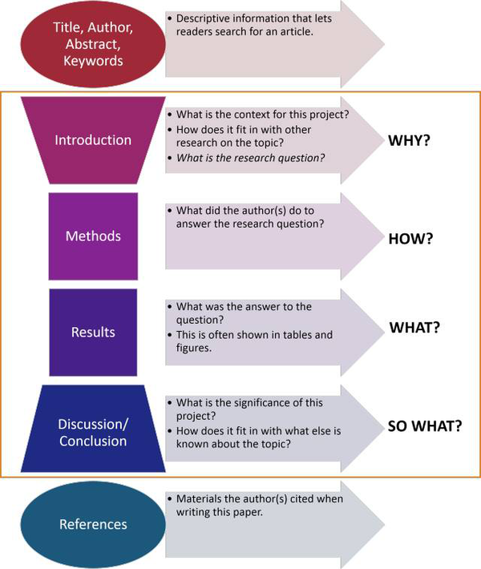

# IDEA input in IMRAD format

## Introduction:
- Why was the study undertaken? 
- What was the research question, the tested hypothesis or the purpose of the research?

## Method:

   
  <a href="https://m.sohu.com/n/476162363/?wscrid=95360_1#p">IMRAD figure reference (optional)</a>

1. When, where, and how was the study done? 
2. What materials were used or who was included in the study groups (patients, etc.)?

## Results:
1. What answer was found to the research question; what did the study find? 
2. Was the tested hypothesis true?

## Discussion:
- What might the answer imply and why does it matter? 
- How does it fit in with what other researchers have found? 
- What are the perspectives for future research?
