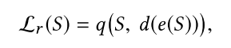
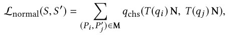
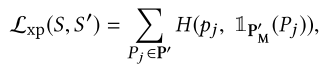

# StructureNet: Hierarchical Graph Networks for 3D Shape Generation

## Introduction

- StructureNet is a hierarchical graph network that attemps to generate novel, diverse, and realistic 3D shapes along with associated part semantics and structure.
- It works directly with n-ary graph encoding of the input shape.

**Github:** https://github.com/daerduoCarey/structurenet

## Method

**1. Structure Representation**

  

  * A shape **S** = (**P**, **H**, **R**) is represented by a set of parts **P** = {*P1*,...,*PN*} describing the geometry of the shape, and a structure (**H**, **R**) that describes how these parts are organized and related to each other.
  * Part's geometry can be presented as its minimum bounding box **Bi** = (ci, qi, ri). In addition to geometry, each part also has a semantic label *li* (encoded as one-hot vector.)
  * **H** are directed edges from a parent part to all the children.
  * Relationship **R** between siblings are denoted as edges *({Pj, Pk}, τ)*, with *τ* is the relationship type (encoded as one-hot vector). These edges form a graph (**Ci**, **Ri**) between siblings of the hierarchy.

**2. Architecture**

  

  * Shape respresentation is encoded into latent space by a VAE.
  * The encoder works recursively in a bottom-up manner using two type of encoders.
      - Geometry encoder: Consists of a single layer perceptron.
      - Graph encoder: encode each child graph
        * We perform several iterations of message passing along the edges of the graph. In each iteration a node aggregates feature of its neighbors and the edges between to compute an updated feature vector. 

 *M* is the number of neighbors and *h* is a SLP.

        * The feature vector of entire graph is computer by max-pooling over all child parts
        

        * We concatenate the grah feature vectors after each iteration and pass the through another SLP.
        

  * The decoder expand nodes in a top-down fashion. First it performs the reverse operation of the **graph encoder** using **graph decoder**, then transform the resulting feature vector of each child with **geometry decoder**.
      - Graph decoder: Transform a parent feature vector into the child graph.
        * Always decode a fixed maximum number *np* of child parts and all edges between them, together with a binary probability that a predicted part of edge exists in the graph.
        * Parts and their relationship are decoded simultaneously.
        

        

        * We can recover the edges between a pair of parts based on their pair of feature vectors 

 *gxe* is a 2-layer MLP.

        * We perform 2 message passing iterations along predicted edges to get the feature vector *fj*

        * Finally, we decode the semantic labels *lj* and a probability *p_leaf* from feature vector *fj*
      - Geometry decoder: A multi-layer perceptron with two layers that transform *fj* to a bounding box *Bj*.

**3. Training and losses**

  

  * Reconstruction loss
    

      - Geometry loss
        

      - Normal loss
        

      - Part existence loss
        

      - Edge existence loss
        

      - Semantic loss
        

      - Leaf loss
        

      Total distance
      

  * Structure consistency loss
      

      

      

      

## Results

* Shape generation

  

  

  

* Limitation

    * Data-driven network, so it will have data biases.

    * May contain models with detached parts or asymetric parts.

      

    * The memory cost is quadratic of number of siblings encoded.

## Discussion

- Apply StructureNet for our document images synthesize problem.