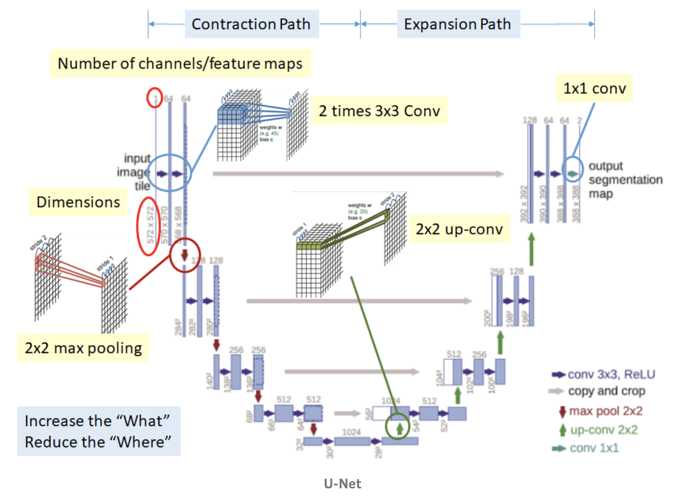
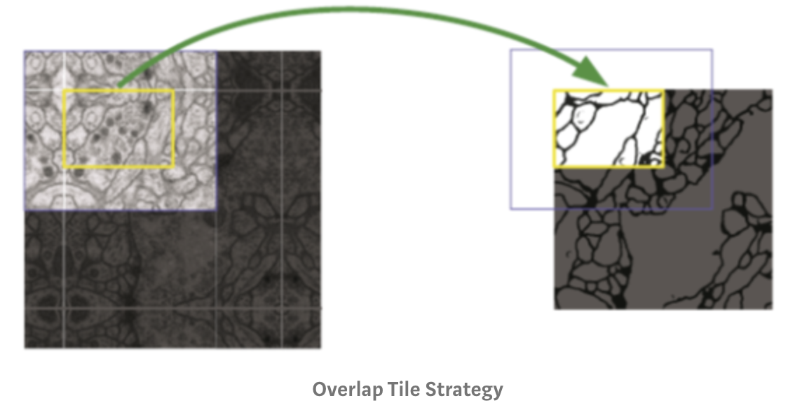
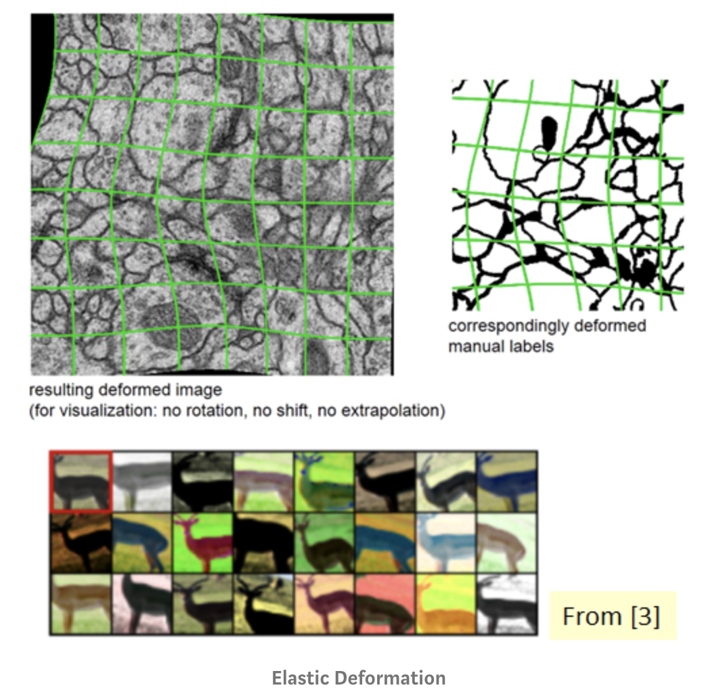
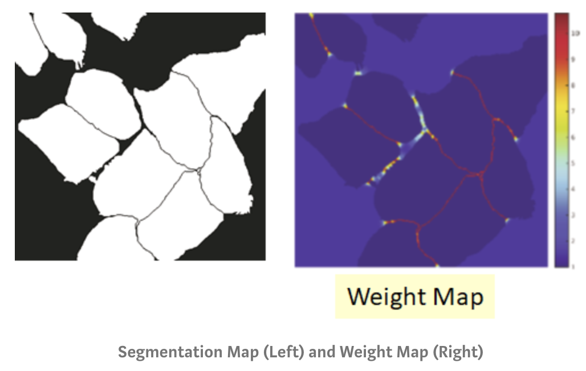
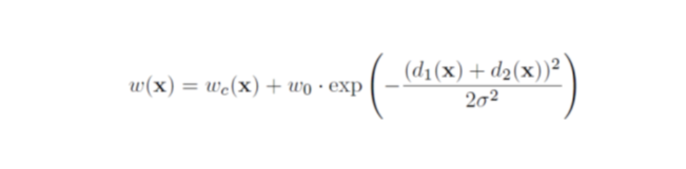
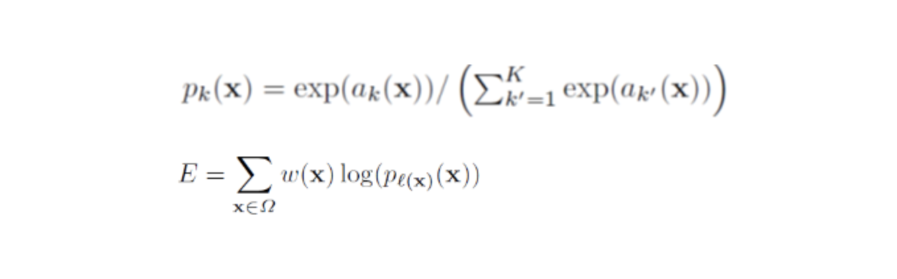
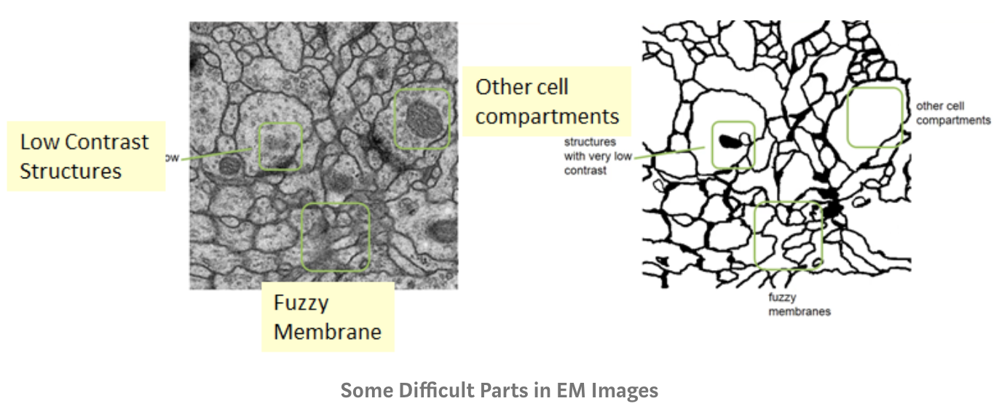
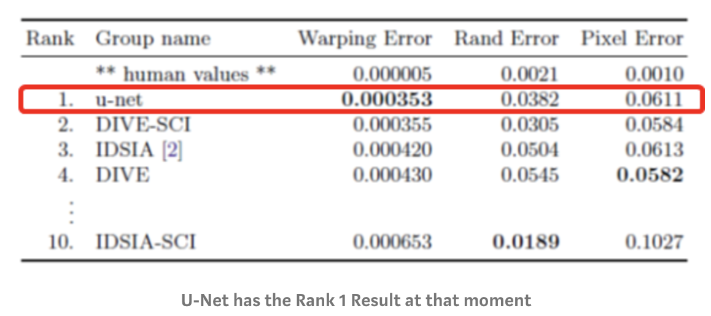
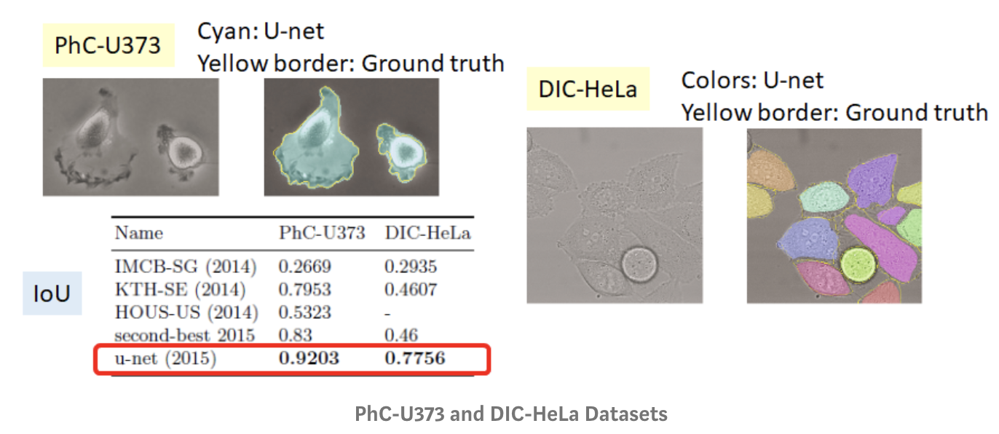

# U-Net: Convolutional Networks for Biomedical Image Segmentation

   ## Introduction:
   **U-Net** consists of a **contracting path** to capture context and a symmetric **expanding path** that enables precise localization. It shows that such a network can be trained **end-to-end** from very few images and outperformans then slidding windows.

   It modifies and extends the FCN(fully convolutional network) architecture such that it works with very few training images and yields more precise segmentations. This is the [summary](OCR/Fully_Convolutional_Networks_for_Semantic_Segmentation.md) of FCN.

   ## Method:
   **1. U-Net Network Architecture**

   

      
   

   

   **Contraction path**

   - Consecutive of two times of 3×3 Conv and 2×2 max pooling is done. This can help to extract more advanced features but it also reduce the size of feature maps.

   **Expansion path**

   - Consecutive of 2×2 Up-conv and two times of 3×3 Conv is done to recover the size of segmentation map. However, the above process reduces the “where” though it increases the “what”. That means, we can get advanced features, but we also loss the localization information.
   - Thus, after each up-conv, we also have concatenation of feature maps (gray arrows) that are with the same level. This helps to give the localization information from contraction path to expansion path.
   - At the end, 1×1 conv to map the feature map size from 64 to 2 since the output feature map only have 2 classes, cell and membrane.

   **2. Trick on Biomedical Image**

   -**Overlap Tile Strategy**

   

      
   

   Since unpadded convolution is used, output size is smaller than input size. Instead of downsizing before network and upsampling after network, overlap tile strategy is used. Thereby, the whole image is predicted part by part as in the figure above. The yellow area in the image is predicted using the blue area. At the image boundary, image is extrapolated by mirroring.

   -**Elastic Deformation for Data Augmentation**

   

      
   

   Since the training set can only be annotated by experts, the training set is small. To increase the size of training set, data augmentation is done by randomly deformed the input image and output segmentation map.

   -**Separation of Touching Objects**

   

      
   

   Since the touching objects are closely placed each other, they are easily merged by the network, to separate them, a weight map is applied to the output of network.
   

      
   

   To compute the weight map as above, d1(x) is the distance to the nearest cell border at position x, d2(x) is the distance to the second nearest cell border. Thus, at the border, weight is much higher as in the figure.
   

      
   

   Thus, the cross entropy function is penalized at each position by the weight map. And it help to force the network to learn the small separation borders between touching cells.

   ## Results:
   

      
   

   

      
   

   -Warping Error: A segmentation metric that penalizes topological disagreements.
   -Rand Error: A measure of similarity between two clusters or segmentations.
   -Pixel Error: A standard pixel-wise error.
   -Training Hour: 10 Hours
   -Testing speed: around 1s per image

   

      
   

   U-Net got the highest IoU for these two datasets.

   ## Discussion:

   1. Modified version of U-Net was in the paper, 4×4 Up-conv is used, and 1×1 Conv to map feature maps from 64 to 7 because the output for each location has 7 classes.

   2. At the Overlap Tile Strategy, zero padding is used instead of mirroring at the image boundary. Because mirroring isn’t making any sense for teeth.

   3. There are additional loss layers to the low-resolution feature maps using softmax loss, in order to guide the deep layers to directly learn the segmentation classes.
